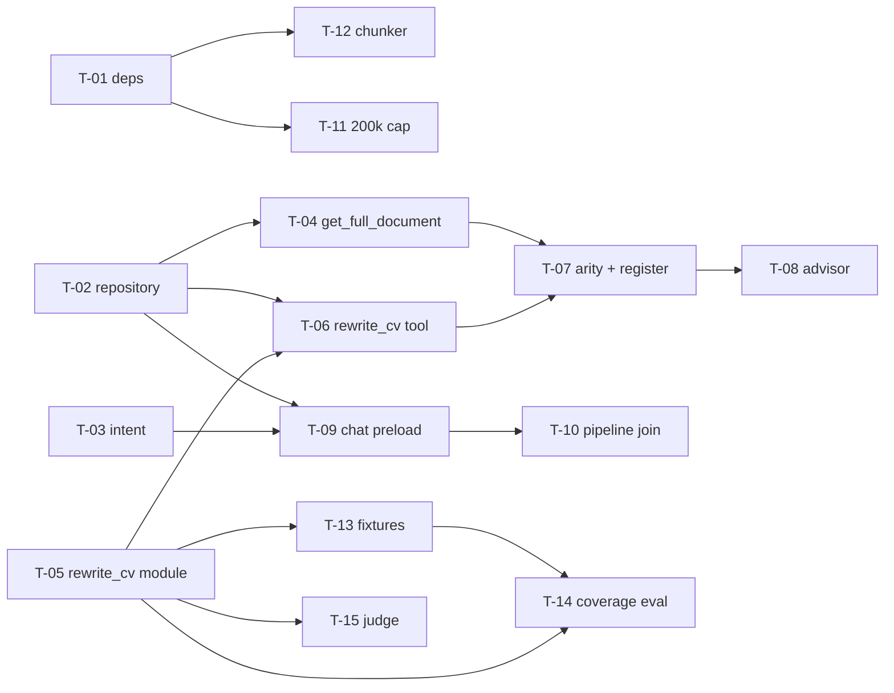

# Development Tasks: Full-Document Retrieval for Generation Tasks (RAG)

**Feature ID:** `rag-full-document-retrieval`

**References:**
- [Product spec](02-product-spec.md) — FR-1..FR-8, contracts, error strings, tag format
- [QA plan](03-qa-plan.md) — TC-001..TC-051

**Summary:** Implement intent-aware full-document preload, `get_full_document` + `rewrite_cv` tools, four-tool advisor wiring, forward-only ingestion (200k text, token chunker, 200 chunks), and offline `rewrite_cv` evals. No schema migrations.

**Totals:** 15 tasks | Estimated overall effort: **L** (multi-day; parallelizable tracks below)

| Area        | Count |
|------------|-------|
| Backend    | 11    |
| Infra (deps) | 1   |
| Evals      | 3     |
| Frontend   | 0     |

---

## Status

COMPLETE

## Task Summary

Total tasks: 15 | Backend: 11 | Frontend: 0 | Infra: 1 | Eval: 3 | Docs: 0

---

## Dependency graph (ordered)

**Parallelism:** After **T-01**, **T-11** and **T-12** can proceed in parallel with **T-02..T-10** (only **T-12** hard-depends on **T-01**). **T-13–T-15** run after **T-05** (and **T-01** for any shared imports).

---

## Tasks

### T-01: Add `langchain-text-splitters` dependency [infra]

- **FR coverage:** FR-5 (prereq for chunker)
- **QA coverage (unblocks / satisfies implementation of):** TC-050
- **Risk:** Low | **Effort:** S
- **Files to create/modify:**
  - `backend/requirements.txt` and/or `backend/pyproject.toml` (match repo convention)
  - `backend/Dockerfile` only if install steps need explicit pins
- **Description:** Add `langchain-text-splitters` (accept transitive `langchain-core` per resolver). Verify `tiktoken` remains declared. Confirm backend image/CI installs cleanly.
- **Acceptance criteria:**
  - [ ] Package declared and installable in Docker/CI
  - [ ] No application code change required beyond dependency lines
- **Depends on:** —
- **Enables test cases:** TC-050

---

### T-02: `UploadedFileRepository` + `FullDoc` [backend]

- **FR coverage:** FR-2, FR-3, FR-4 (data access)
- **QA coverage:** TC-016, TC-017 (repository/tool behavior); supports TC-024–TC-026
- **Risk:** Medium | **Effort:** M
- **Files to create/modify:**
  - `backend/app/repositories/uploaded_file_repository.py` (new)
  - `backend/app/repositories/__init__.py` if the repo exports repositories
- **Description:** Implement frozen `@dataclass FullDoc` and `get_latest_full_text_by_document_type(candidate_id, document_type) -> FullDoc | None` per product spec: latest row `ORDER BY created_at DESC LIMIT 1`, filter `candidate_id` + `document_type`, require non-empty `extra["extracted_text"]` (or equivalent); return `None` if missing/empty. No raw ORM in routes/tools beyond this repository.
- **Acceptance criteria:**
  - [ ] API matches spec contract in `02-product-spec.md`
  - [ ] Latest-only semantics; never concatenate multiple files of same type
- **Depends on:** —
- **Enables test cases:** TC-016, TC-017 (+ downstream FR-4 preload tests once wired)

---

### T-03: Pin `_REWRITE_INTENT_RE` and `classify_rewrite_intent(message) -> bool` [backend]

- **FR coverage:** FR-1
- **QA coverage:** TC-001..TC-010
- **Risk:** Medium | **Effort:** S
- **Files to create/modify:**
  - `backend/app/dspy/intent.py` (recommended) or `backend/app/api/intent.py` — single module exporting regex + classifier used by `chat.py` and tests
- **Description:** Copy **authoritative** regex from FR-1 into one module. Implement `classify_rewrite_intent(message: str) -> bool` as match on compiled pattern. Document that v1 is two-way only (no borderline mode).
- **Acceptance criteria:**
  - [ ] Regex byte-for-byte aligned with spec (`(?i)` and alternation order as given)
  - [ ] Callable usable from `chat.py` and unit tests without duplication
- **Depends on:** —
- **Enables test cases:** TC-001..TC-010

---

### T-04: Implement `get_full_document` tool (not yet registered in `build_agent_tools`) [backend]

- **FR coverage:** FR-2
- **QA coverage:** TC-011..TC-017
- **Risk:** Medium | **Effort:** M
- **Files to create/modify:**
  - `backend/app/dspy/agent_tools.py`
- **Description:** Add async inner tool with strict validation for **exactly** `cv`, `life_story`, `recommendation_letter`, `grade_sheet`. Return **exact** error strings from spec for invalid type and missing document. On success, include full `extracted_text` for latest file (wrapping/filename optional but body must be complete). Use `UploadedFileRepository` from T-02 via injected `session` + `candidate_id` closure pattern (mirror `retrieve_candidate_context`). **Do not** add to `build_agent_tools` return tuple until **T-07** (keeps arity change atomic).
- **Acceptance criteria:**
  - [ ] All error/success behaviors match `02-product-spec.md` strings
  - [ ] `build_agent_tools` signature unchanged until T-07
- **Depends on:** T-02
- **Enables test cases:** TC-011..TC-017

---

### T-05: `rewrite_cv` DSPy module + mock [backend]

- **FR coverage:** FR-3 (generation), FR-7 (eval hook)
- **QA coverage:** Supports TC-018..TC-023, TC-042..TC-045
- **Risk:** Medium | **Effort:** M
- **Files to create/modify:**
  - `backend/app/dspy/rewrite_cv.py` (new)
- **Description:** DSPy `Signature` + `Module` taking CV text (required input), optional life story, candidate profile JSON, school dossier text, `target_school`, `emphasis`; output rewritten CV body. Add `MockRewriteCVModule` for `DSPY_MODE=mock` with deterministic stub text suitable for evals. No `save_artifact` inside module — side effects stay in tool wrapper (T-06).
- **Acceptance criteria:**
  - [ ] Mock path works without live LLM
  - [ ] Module returns text only
- **Depends on:** —
- **Enables test cases:** TC-018..TC-023 (with T-06); TC-042..TC-045

---

### T-06: `rewrite_cv` tool wrapper in `agent_tools` [backend]

- **FR coverage:** FR-3
- **QA coverage:** TC-018..TC-023
- **Risk:** High | **Effort:** M
- **Files to create/modify:**
  - `backend/app/dspy/agent_tools.py`
  - Possibly narrow helper for `knowledge_chunks` dossier lookup by `target_school` (same file or small helper module if no existing pattern)
- **Description:** `async def rewrite_cv(target_school: str = "", emphasis: str = "") -> str`. Load latest CV via T-02; if missing, return **exact** error string from spec and **do not** call `save_artifact`. Optionally load life story, profile JSON (same sources as advisor), dossier when `target_school` non-empty and matching chunk exists — else skip silently. On success, invoke T-05 module, then call existing `save_artifact` with `artifact_type="cv_draft"` per existing conventions; return rewritten text.
- **Acceptance criteria:**
  - [ ] Missing CV path never persists draft
  - [ ] Happy path persists `cv_draft` and returns body string
- **Depends on:** T-02, T-05
- **Enables test cases:** TC-018..TC-023

---

### T-07: `build_agent_tools` → four tools + unpack sites [backend]

- **FR coverage:** FR-2, FR-3, FR-6
- **QA coverage:** TC-038, TC-039
- **Risk:** High | **Effort:** M
- **Files to create/modify:**
  - `backend/app/dspy/agent_tools.py` — return `(retrieve_candidate_context, save_artifact, get_full_document, rewrite_cv)` in that order
  - `backend/app/dspy/pipeline.py` — unpack four callables
  - `backend/tests/test_agent_advisor_unit.py` — all `build_agent_tools` unpacks (grep `build_agent_tools`)
- **Description:** Register T-04 and T-06 tools in `build_agent_tools`. Update every unpack to four-tuple. Grep repo for `build_agent_tools` and `retrieve_fn, save_fn` patterns.
- **Acceptance criteria:**
  - [ ] Tuple order exactly as spec
  - [ ] No stale two-tuple unpacks in `backend/`
- **Depends on:** T-04, T-06
- **Enables test cases:** TC-038, TC-039

---

### T-08: `AgentAdvisorSignature` + `AgentAdvisorModule` + `MockAgentAdvisorModule` [backend]

- **FR coverage:** FR-6
- **QA coverage:** TC-040, TC-041; supports TC-046, TC-047
- **Risk:** High | **Effort:** M
- **Files to create/modify:**
  - `backend/app/dspy/agent_advisor.py`
  - `backend/app/dspy/pipeline.py` (pass four tools into module constructors)
- **Description:** Document all four tools in signature text; add explicit rule: for rewrite/redraft of a **specific uploaded document**, prefer full text (preload or `get_full_document`); do not rely on `retrieve_candidate_context` alone. Register four tools in ReAct; update mocks. Increase `max_iters` if rewrite trajectories require more steps (document new value in code comment if changed).
- **Acceptance criteria:**
  - [ ] Four tools in module tool list
  - [ ] Mock advisor accepts four tools and tests remain mock-first
- **Depends on:** T-07
- **Enables test cases:** TC-040, TC-041; FR-8 tests once written

---

### T-09: Intent branch in `chat.py::_retrieve_doc_snippets` [backend]

- **FR coverage:** FR-1, FR-4 (preload source)
- **QA coverage:** TC-024..TC-028, TC-030, TC-048 (with tests)
- **Risk:** High | **Effort:** M
- **Files to create/modify:**
  - `backend/app/api/routes/chat.py`
- **Description:** If `classify_rewrite_intent(message)` (T-03): **skip** `search_async` for preload; build snippets from T-02 for latest **CV** and **life story** only, using **exact** tag strings from FR-4. If neither present, yield empty preload list (no semantic fallback for that turn per v1 replace semantics). If intent False: preserve existing embed + `search_async` path (`top_k` default unchanged) and existing no-API-key fallback.
- **Acceptance criteria:**
  - [ ] No `search_async` on intent match for preload
  - [ ] Non-match path unchanged (TC-030/048 testable)
- **Depends on:** T-02, T-03
- **Enables test cases:** TC-024..TC-028, TC-030, TC-048

---

### T-10: `pipeline.py` preload joining — full-doc vs semantic [backend]

- **FR coverage:** FR-4
- **QA coverage:** TC-029 (+ integration with T-09)
- **Risk:** Medium | **Effort:** S
- **Files to create/modify:**
  - `backend/app/dspy/pipeline.py`
- **Description:** Detect full-document preload (tagged blocks from T-09) vs semantic chunk list. Join full-doc blocks with `\n\n` **without** `[{i+1}]` prefixes. Keep existing numbered formatting for semantic top-k path (~263–266 behavior).
- **Acceptance criteria:**
  - [ ] Tagged output matches FR-4 literally when passed through join
  - [ ] Semantic path unchanged
- **Depends on:** T-09 (contract for snippet shape)
- **Enables test cases:** TC-029; TC-024..TC-026 integration

---

### T-11: Raise `extracted_text` storage cap to 200_000 [backend]

- **FR coverage:** FR-5
- **QA coverage:** TC-031, TC-036
- **Risk:** Low | **Effort:** S
- **Files to create/modify:**
  - `backend/app/workers/tasks/document_processing.py` (`_extract_text` or equivalent)
- **Description:** Store up to **200_000** characters in `extracted_text`. Leave `_CLASSIFY_MAX_CHARS = 4000` unchanged. Forward-only — no backfill job.
- **Acceptance criteria:**
  - [ ] Long inputs truncate at 200k for new processing
  - [ ] Classifier cap unchanged (TC-036)
- **Depends on:** —
- **Enables test cases:** TC-031, TC-036

---

### T-12: Token-aware chunking + chunk cap 200 [backend]

- **FR coverage:** FR-5
- **QA coverage:** TC-032..TC-035, TC-037
- **Risk:** Medium | **Effort:** M
- **Files to create/modify:**
  - `backend/app/workers/tasks/document_processing.py`
- **Description:** Replace paragraph split + `[:25]` with `RecursiveCharacterTextSplitter.from_tiktoken_encoder` using encoder compatible with `text-embedding-3-small` / `cl100k_base`, `chunk_size=600`, `chunk_overlap=50`. Raise per-file chunk list cap to **200**. Applies only to new/reprocessed uploads; existing `document_chunks` rows untouched until reprocess.
- **Acceptance criteria:**
  - [ ] Chunk count ≤ 200; chunks ≤ 600 tokens (last may be shorter)
  - [ ] Short docs and overlap edge cases handled without failure
- **Depends on:** T-01
- **Enables test cases:** TC-032..TC-035, TC-037

---

### T-13: Synthetic CV fixtures under `evals/fixtures/cv/` [backend]

- **FR coverage:** FR-7
- **QA coverage:** TC-042 (data prereq)
- **Risk:** Low | **Effort:** M
- **Files to create/modify:**
  - `backend/evals/fixtures/cv/` (~5 files + metadata sidecar or structured JSON per team norm)
- **Description:** ~5 hand-crafted CVs: varied length/sections, non-English names, gaps, multi-role at one company; **no PII**. Each fixture includes structured metadata (roles, companies, date ranges, education) for deterministic fuzzy coverage checks.
- **Acceptance criteria:**
  - [ ] Files committed and referenced by eval package
  - [ ] Metadata sufficient for ≥95% field coverage rule
- **Depends on:** —
- **Enables test cases:** TC-042

---

### T-14: `rewrite_cv` coverage eval (deterministic, mock CI) [backend]

- **FR coverage:** FR-7
- **QA coverage:** TC-042, TC-043, TC-045
- **Risk:** Medium | **Effort:** M
- **Files to create/modify:**
  - `backend/evals/rewrite_cv/` (package: runner, metrics, `__main__` or docstring entrypoint per spec)
  - Align with `backend/evals/run_evals.py` / existing patterns
- **Description:** For each fixture, run mock rewrite module; fuzzy-match ≥95% of structured metadata fields present in output. Include failing fixture path (TC-043) for gate. Default CI: `DSPY_MODE=mock` only (TC-045).
- **Acceptance criteria:**
  - [ ] Pass/fail per fixture + aggregate; documented run command in module docstring
  - [ ] No live OpenAI required for default gate
- **Depends on:** T-05, T-13
- **Enables test cases:** TC-042, TC-043, TC-045

---

### T-15: LLM-judge hallucination pass (gated) [backend]

- **FR coverage:** FR-7
- **QA coverage:** TC-044
- **Risk:** Medium | **Effort:** S
- **Files to create/modify:**
  - `backend/evals/rewrite_cv/` (judge submodule)
- **Description:** Optional judge flags ungrounded facts; runs **only** when `DSPY_MODE=openai` (or equivalent env gate). Skipped silently in default CI.
- **Acceptance criteria:**
  - [ ] Default CI does not require judge
  - [ ] When enabled, judge executes and reports structured result
- **Depends on:** T-05, T-14 (optional: can stub after T-05)
- **Enables test cases:** TC-044

---

## Implementation Order

1. T-01
2. T-02
3. T-03
4. T-04
5. T-05
6. T-06
7. T-07
8. T-08
9. T-09
10. T-10
11. T-11
12. T-12
13. T-13
14. T-14
15. T-15

**Note:** T-11–T-12 may start after **T-01** in parallel with T-02..T-10. T-13 can start early; **T-14** needs **T-05** + **T-13**.

---

## Rollout / deploy notes

- **No Alembic migration required** — limits are code constants only; per product spec and repo rule, do not hand-author migrations for this feature.
- **Forward-only:** Existing uploads are **not** auto-reindexed; `document_chunks` / embeddings for old files stay as-is until re-upload or explicit reprocess.
- **Dependency install:** After merge, rebuild backend image / `pip install -r backend/requirements.txt` so `langchain-text-splitters` (and any transitive deps) are present (TC-050).
- **Optional:** Document one-line `pip`/Docker rebuild in PR for operators.

---

## Testing strategy (post-implementation)

Automated tests listed in [`03-qa-plan.md`](03-qa-plan.md) (**TC-001..TC-051**) are **not** implemented as tasks in this file. After implementation, use **`/feature-write-tests`** to add/extend tests per QA plan; each task above lists **QA coverage** / **Enables test cases** for traceability.

---

## Output Artifacts

- `01-ba-analysis.md`
- `02-product-spec.md`
- `03-qa-plan.md`
- `04-tasks.md`

---

> **Next:** run `/feature-dev` to begin implementation (stops after each task; resume with the same command).
