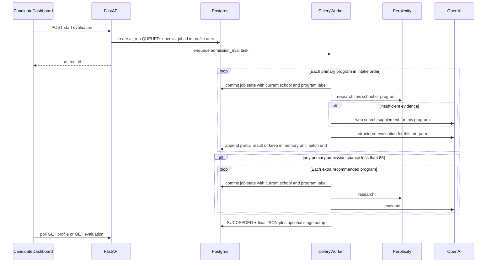

# Admission evaluation phase (replace profile generation)

## Current state

- **Marketing phases** live in [`apps/web/src/components/CandidateIntakeForm.tsx`](apps/web/src/components/CandidateIntakeForm.tsx): `PHASES` includes `"02. Profile Generation"` and `"03. Evaluation"`, with sidebar copy **“1/7 Phases”** and a **“Continue to Phase 02”** button after Step 4 (lines ~153–161, ~1014, ~1952). There is no separate profile-generation screen—only labels implying the next step.
- **After intake**, [`apps/web/src/components/CandidateDashboard.tsx`](apps/web/src/components/CandidateDashboard.tsx) renders an almost empty shell (`StageProgressBar` only; `handleProfileUpdate` is unused, so the bar stays at step 1).
- **Selected programs** are already persisted: `school_program_selections` on intake PATCH flows into profile attributes (see [`backend/app/schemas/candidates.py`](backend/app/schemas/candidates.py)); tests show the shape in [`backend/tests/test_candidate_sessions_auth.py`](backend/tests/test_candidate_sessions_auth.py).
- **Infra to reuse**: Perplexity + DSPy bootstrap in [`backend/app/core/dspy_runtime.py`](backend/app/core/dspy_runtime.py) and batch patterns in [`backend/scripts/research_program_dossiers.py`](backend/scripts/research_program_dossiers.py); OpenAI fallback pattern in [`backend/app/dspy/school_program_offerings.py`](backend/app/dspy/school_program_offerings.py) (`run_school_program_offerings_openai`). **Celery + `ai_runs`** pattern in [`backend/app/api/routes/jobs.py`](backend/app/api/routes/jobs.py), [`backend/app/workers/tasks/sample_ai_job_task.py`](backend/app/workers/tasks/sample_ai_job_task.py), [`backend/app/db/models/ai_run.py`](backend/app/db/models/ai_run.py).
- **Pipeline stage enum**: [`backend/app/db/enums.py`](backend/app/db/enums.py) `CandidateStage` has `PROGRAM_RESEARCH` (no separate “evaluation” stage); advancing `candidates.stage` after evaluation completes will align admin/UI stage strings if you surface them later.

## Target behavior (agreed)

- **Extra “similar programs” research** runs when **any** selected program has admission chance **&lt; 85%** (your selection).

- **Program-by-program pipeline (primary selections):** For each user-selected `(school, program)` **in a fixed order** (intake list order, up to 4), the worker runs **research → optional OpenAI supplement → structured evaluation** for **that program only**, then moves to the next. Do **not** batch-research all schools and only then evaluate all; the candidate should always see **which school** is currently being worked on. The same program-by-program pattern applies to **extra** recommended programs when that phase runs (each extra school shown as current while it is researched and evaluated).

## Architecture



## 1) Frontend — remove profile generation + add evaluation UI

- **Intake sidebar**: Update `PHASES` to **6** phases by **removing** `"02. Profile Generation"` and renumbering (Evaluation becomes `02`, etc.). Change **“1/7 Phases”** → **“1/6 Phases”** (and any other hard-coded `/7`).
- **Final CTA**: Replace **“Continue to Phase 02”** with copy that matches the new roadmap (e.g. **“Continue to evaluation”** or **“Continue to Phase 02 — Evaluation”**).
- **Post-intake**: In [`CandidateDashboard.tsx`](apps/web/src/components/CandidateDashboard.tsx), when `needsIntake` is false:
  - If evaluation is **not** complete (see stored flag below), render a dedicated **evaluation panel** (new component, e.g. `AdmissionEvaluationPanel.tsx`) instead of the empty layout.
  - **While the job is running**: Use the **§1c** Stitch layout (“RESEARCH IN PROGRESS”, overall %, primary status line, checklist). **Always show the active school (and program)** the agent is working on—e.g. a dedicated line **“Researching: [School Name] — [Program label]”** or equivalent under the header, driven by `admission_evaluation_job.current_school` + `current_program_display_name` (see §2). Sub-status `message` can refine the step (e.g. “Gathering program requirements…”, “Writing your evaluation…”). Map `progress_percent` / checklist rows to **per-program** progress: which programs are done vs the one in progress (research sub-step vs evaluation sub-step within the current program), not only four global phases.
  - **Polling**: `GET` candidate profile (existing [`fetchCandidateProfile`](apps/web/src/lib/api.ts)) on an interval while status is in-flight; stop when terminal.
  - **Completion**: Implement the results view per **§1b** below. Optionally set `StageProgressBar` `currentStage` to **3** (“Program Research”) or **2** (“Diagnosis”) for visual consistency—pick one and document in code comment (recommend **3 — Program Research** as closest semantic match to “school/program research”).

### 1b) Stitch design — Consolidated Evaluation Results

**Source of truth for layout, typography, and hierarchy** (not the generic “two columns” placeholder):

| Field | Value |
|-------|--------|
| Project | AI Consultation |
| Project ID | `8777623071946293026` |
| Screen | Consolidated Evaluation Results |
| Screen ID | `e1c973adc9634ad6ab5dbe0739c71976` |
| Resource name | `projects/8777623071946293026/screens/e1c973adc9634ad6ab5dbe0739c71976` |

**Download assets for offline reference** (URLs expire; re-fetch via Stitch MCP `get_screen` if needed):

- **Screenshot (PNG):** `https://lh3.googleusercontent.com/aida/ADBb0ug0Pp-utgRaR1779ciCL9-JurCrPpxr5RyvpfHfJiiSHID2J5P97ugMEUW5GAAEbvDzqIPQQtNmoLK30ON7TW3g1MkEFHSjq3T4WsqrWjTo1qt2d5J1G1k1JCwAxAiO58fFhVOG-bhTAmPPGzHzK0vMrvKl_9mFuUvs2UD6lookeX0b2iQsDBlggv5YqgmplWyDOukLwWrAJ3_A3infq1TBc5uDOnvNaRmfwYztVmOnWBqUTPg8vanu66c`
- **HTML:** `https://contribution.usercontent.google.com/download?c=CgthaWRhX2NvZGVmeBJ7Eh1hcHBfY29tcGFuaW9uX2dlbmVyYXRlZF9maWxlcxpaCiVodG1sX2ExZjBkZTE0OTU1OTQ3YmU4MDBiMmIyMDQ1MmI4N2M3EgsSBxC-kr3X-AsYAZIBIwoKcHJvamVjdF9pZBIVQhM4Nzc3NjIzMDcxOTQ2MjkzMDI2&filename=&opi=89354086`

**Suggested repo paths** (mirror existing [`apps/web/design-reference/stitch-ai-consultation-8777623071946293026/`](apps/web/design-reference/stitch-ai-consultation-8777623071946293026/) layout):

- `screens/consolidated-evaluation-results/screen.png` (from screenshot URL)
- `screens/consolidated-evaluation-results/screen.html` (from HTML URL)

Example:

```bash
mkdir -p apps/web/design-reference/stitch-ai-consultation-8777623071946293026/screens/consolidated-evaluation-results
curl -L -o apps/web/design-reference/stitch-ai-consultation-8777623071946293026/screens/consolidated-evaluation-results/screen.png "PASTE_SCREENSHOT_URL"
curl -L -o apps/web/design-reference/stitch-ai-consultation-8777623071946293026/screens/consolidated-evaluation-results/screen.html "PASTE_HTML_URL"
```

**UI structure to replicate in React/Tailwind** (from the Stitch HTML):

1. **Header / page title** — e.g. “Evaluation” editorial-style title (match Stitch).
2. **Primary block — one card per program of choice** (user-selected schools), each with:
   - School name (e.g. Harvard Kennedy School) + program line (e.g. MPP Candidate / MBA CANDIDATE) — use display labels from intake (`program_slug` → human label) + school.
   - **Core Strengths** — bullet list (maps to agent strengths).
   - **Strategic Gaps** — bullet list (maps to weaknesses).
   - **Narrative Strategy** — paragraph combining *what to emphasize* and *what to improve* (split or merge from `emphasis_areas` + `profile_improvements` per LLM or deterministic template).
   - **Admission Chance** — percentage + **band label** (Stitch examples: TARGET, MODERATE, PROBABLE, STRETCH) — derive bands from score ranges in the UI layer or return from the agent.
   - **Priority Actions** — numbered list (split from `profile_improvements` / `emphasis_areas` or a dedicated short list from the evaluator JSON).
3. **Secondary block — “Additional Recommendations”** — subtitle: *Agent-suggested programs with high secondary alignment* — **only when** the extra-research path ran; compact card per extra program: school + program name, **Key Match**, **Action Item**, **Match Strength** %, metadata line (location, duration, etc. where available from catalog).
4. **Footer actions** — Stitch shows **Export Full Report** (optional / later) and **Proceed to Positioning** (wire when positioning phase exists).

**Data mapping** — extend or shape `admission_evaluation_result` JSON so the UI can render the above without ad-hoc string parsing:

- `primary[]`: `school`, `program_slug`, `program_display_name`, `strengths[]`, `weaknesses[]`, `narrative_strategy` (or `emphasis` + `improvements` merged), `admission_chance_1_100`, `admission_band` (optional), `priority_actions[]` (strings).
- `extra[]` (secondary recommendations): `school`, `program_display_name`, `key_match`, `action_item`, `match_strength_1_100`, `meta` (location, format tags).

**Theme tokens** — reuse existing [`theme-tokens.json`](apps/web/design-reference/stitch-ai-consultation-8777623071946293026/theme-tokens.json) and [`design-system-spec.md`](apps/web/design-reference/stitch-ai-consultation-8777623071946293026/design-system-spec.md) in the same project folder for alignment with the rest of the AI Consultation Stitch set.

### 1c) Stitch design — AI Research Progress (loading / agent working)

**Source of truth for the in-progress state** while the agent runs research and downstream steps (before §1b results exist).

| Field | Value |
|-------|--------|
| Project | AI Consultation |
| Project ID | `8777623071946293026` |
| Screen | AI Research Progress - Clean View |
| Screen ID | `47285f23e2794fd58fb26877d5667324` |
| Resource name | `projects/8777623071946293026/screens/47285f23e2794fd58fb26877d5667324` |

**Download assets for offline reference** (URLs expire; re-fetch via Stitch MCP `get_screen` if needed):

- **Screenshot (PNG):** `https://lh3.googleusercontent.com/aida/ADBb0uj_ylqv9iZrM6C0bDRbXBujo_QiNXreX9MeGMj4Y2mJRoCEBV4oAXZ3HwkuvFTl7MZUhCLRs7sJgM8lWPg1zxG2_ORVYNjJdZQGLUCwlpxOTkaOTmE-z7FnshwnY48f4d6cWt5BId5iwUxiEh62CpeP-Vc_JRXBXX1IubkBYwFcd_aSlwjPTuJHaeZTO4SHY0cg4Cu6pccQdA4BszGAjKBDpSteBHGDXtmu1rhik-x4ABM24shZL8ds9SY`
- **HTML:** `https://contribution.usercontent.google.com/download?c=CgthaWRhX2NvZGVmeBJ7Eh1hcHBfY29tcGFuaW9uX2dlbmVyYXRlZF9maWxlcxpaCiVodG1sXzU4Y2Q5YzNlMjVmNDQ2MmJhYzMwNDYzMDQ3N2QyMWVlEgsSBxC-kr3X-AsYAZIBIwoKcHJvamVjdF9pZBIVQhM4Nzc3NjIzMDcxOTQ2MjkzMDI2&filename=&opi=89354086`

**Suggested repo paths:**

- `screens/ai-research-progress-clean-view/screen.png`
- `screens/ai-research-progress-clean-view/screen.html`

Example:

```bash
mkdir -p apps/web/design-reference/stitch-ai-consultation-8777623071946293026/screens/ai-research-progress-clean-view
curl -L -o apps/web/design-reference/stitch-ai-consultation-8777623071946293026/screens/ai-research-progress-clean-view/screen.png "PASTE_SCREENSHOT_URL"
curl -L -o apps/web/design-reference/stitch-ai-consultation-8777623071946293026/screens/ai-research-progress-clean-view/screen.html "PASTE_HTML_URL"
```

**UI structure to replicate in React/Tailwind** (from the Stitch HTML):

1. **Editorial header** — e.g. “The Academic Editorial” + “Evaluation Research” (match Stitch).
2. **Status region** — **“RESEARCH IN PROGRESS”** (or equivalent), large **percentage** (e.g. 68%) — tie to `admission_evaluation_job.progress_percent` if added, else derive from phase (0–100).
3. **Primary line** — icon + short dynamic line (e.g. “Synthesizing competitive landscape data…”) from `message` or phase-specific copy.
4. **Checklist / pipeline steps** — vertical list with **completed** (check), **in progress** (spinner/highlight), **pending** (empty circle). Prefer **one row per user-selected program** (and, during the extra phase, one row per extra program), with labels including **school name**, so the candidate sees the queue; the **active** row matches `current_school`. Optional second row group or sub-bullets for “Research” vs “Evaluation” under the active program if the Stitch single-column list needs more detail—keep **school name visible** in the primary line (item 3) at minimum.
5. **Bottom nav** (if present in Stitch) — match visually; wire “Eval” as active or omit if dashboard already has primary nav.

**Backend alignment** — Extend `admission_evaluation_job` so polling is meaningful per program:
  - **Required for UX:** `current_school`, `current_program_display_name` (and optionally `current_program_slug`), `program_index` (0-based within the current phase: primary vs extra), `programs_total` for that phase, `substep`: `"research"` | `"evaluate"` | `"supplement"` (second-pass search for the current program).
  - **Optional:** `progress_percent` (0–100 across all work), `programs_completed[]` (list of `{ school, program_display_name }` finished so far), `steps[]` for checklist sync.
  - If checklist rows are **per program**, derive row state: completed if index &lt; `program_index`, active if index === `program_index`, pending otherwise; use `substep` to animate the active row.

## 2) Data contract (stored on profile to avoid blocking on migrations initially)

- Persist under `profile.attributes` (names illustrative; keep consistent in code):
  - `admission_evaluation_job`: `{ ai_run_id, phase, message, updated_at, current_school, current_program_display_name, current_program_slug?, program_index, programs_total, substep, phase_scope: "primary"|"extra", progress_percent?, programs_completed?, steps? }` — **must** allow the UI to show **which school** is being researched or evaluated at any poll tick.
  - `admission_evaluation_result`: `{ status: complete|failed, primary: [...], extra: [...], error?: string }` when done.
  - `admission_evaluation_seen_at` or a boolean `admission_evaluation_complete` if you need a hard gate for “dashboard v2”.

**Optional later**: move large blobs to `ai_runs.response` only; keep a summary on profile for fast GET.

**Alembic**: If you later add dedicated columns or a new `AiRunType` enum value in Postgres, use **autogenerate** only after the feature is functionally done (per your rule).

## 3) Backend — orchestration

- **New DSPy (or plain service) modules** under e.g. `backend/app/dspy/` or `backend/app/services/`:
  - **Outer driver**: Iterate **primary** `school_program_selections` in order; for each, call **research → sufficiency → optional supplement → evaluation**, updating **`admission_evaluation_job`** after each substep with `current_school`, `substep`, and indices, then proceed. Repeat the same inner sequence for each **extra** program if the &lt;85% branch runs.
  - **Program research (Perplexity)**: One call per `(school, program_label)` building a prompt that asks for admissions criteria, class profile, selectivity signals, deadlines (whatever your evaluation needs). Reuse LiteLLM Perplexity configuration like the research script.
  - **Sufficiency check**: Deterministic + small LLM judge: e.g. minimum length, required sections present, or a binary “enough to evaluate?” classifier. If false → **OpenAI second pass** **for that program only** (still same `current_school` in job state).
  - **OpenAI web search**: Implement using the **OpenAI Responses API + `web_search` tool** (SDK `openai` is already pinned in [`backend/requirements.txt`](backend/requirements.txt)); if tooling is unavailable in your deployment, fallback to the existing **DSPy + `openai/...` + strong “cite sources”** prompt (same spirit as `run_school_program_offerings_openai`).
  - **Evaluation generator**: Given **research text + candidate profile snapshot + `intake_test_scores`**, output **strict JSON** for **one program at a time**, shaped for **§1b**:
    - `strengths[]`, `weaknesses[]`, `admission_chance_1_100`, optional `admission_band`, `narrative_strategy` (or `emphasis` + `improvements` merged in a post-step), `priority_actions[]` (numbered strings)
  - **Similar programs** (when **any** primary `admission_chance_1_100 < 85`):
    - Build candidate set from [`backend/app/constants/graduate_programs_catalog.py`](backend/app/constants/graduate_programs_catalog.py) / `programs_by_school` payload already used for intake—**exclude** duplicates of user selections.
    - Use a **shortlist step** (LLM picks 2–3 pairs) with a deterministic fallback (e.g. same `program_slug` at peer schools) so the pipeline never returns empty silently.
    - Then run the **same per-program research/eval loop** for each extra pair, with `phase_scope: "extra"` and visible school names in job state.

- **Celery task** (new file under `backend/app/workers/tasks/`):
  - Bind similar to [`sample_ai_job_task.py`](backend/app/workers/tasks/sample_ai_job_task.py): create/use `AiRun`, set `RUNNING`, **commit progress to `profile.attributes` after each program’s research start, supplement, and evaluation** so polling always reflects the active school ([`backend/app/core/sync_db.py`](backend/app/core/sync_db.py)).
  - On success: `SUCCEEDED`, store final JSON, set `admission_evaluation_complete`, optionally `candidate.stage = CandidateStage.PROGRAM_RESEARCH`.
  - On failure: `FAILED`, user-visible error string.

- **API routes** (new router or extend [`backend/app/api/routes/candidates_enter.py`](backend/app/api/routes/candidates_enter.py)):
  - `POST /candidates/me/admission-evaluation/start` — idempotent: if job already running or completed recently, return existing state.
  - `GET /candidates/me/admission-evaluation` (optional thin wrapper) — or rely on existing `GET /candidates/me` if attributes are included.

- **Wire task** in [`backend/app/core/celery_app.py`](backend/app/core/celery_app.py) imports (same pattern as other tasks).

## 4) Types and API client

- Add TypeScript types + functions in [`apps/web/src/lib/api.ts`](apps/web/src/lib/api.ts) for start + parsing `attributes` evaluation blobs.

## 5) Tests

- **Backend**: Async route tests (auth like existing candidate tests) with **mocked** Celery enqueue or mocked research/eval functions; assert progress fields and final shape.
- **Worker**: Unit test orchestration with stubs for Perplexity/OpenAI (no real network); assert job state updates include **`current_school` / `substep`** as each mocked program is processed.

## 6) Env / ops

- Document in [`.env.example`](.env.example): `PERPLEXITY_API_KEY`, existing OpenAI keys; note Responses API may need a specific model allowlist.

## Files likely touched (concise)

| Area | Files |
|------|--------|
| Intake copy | [`CandidateIntakeForm.tsx`](apps/web/src/components/CandidateIntakeForm.tsx) |
| Dashboard + new UI | [`CandidateDashboard.tsx`](apps/web/src/components/CandidateDashboard.tsx), new `AdmissionEvaluationPanel.tsx` (or similar) |
| Client API | [`apps/web/src/lib/api.ts`](apps/web/src/lib/api.ts) |
| Routes | new `admission_evaluation.py` + router include, or `candidates_enter.py` |
| Worker | new task + `celery_app` wiring |
| Logic | new `dspy`/service modules |

## Non-goals (this pass)

- Parity with unrelated Stitch screens under `apps/web/src/design/` unless needed for shared components.
- Manual Alembic migrations before feature completion.

## Implementation note (Stitch)

- Prefer **MCP `get_screen`** to refresh `downloadUrl` values if `curl` returns 403/expired links:
  - Results: `projects/8777623071946293026/screens/e1c973adc9634ad6ab5dbe0739c71976`
  - In progress: `projects/8777623071946293026/screens/47285f23e2794fd58fb26877d5667324`
