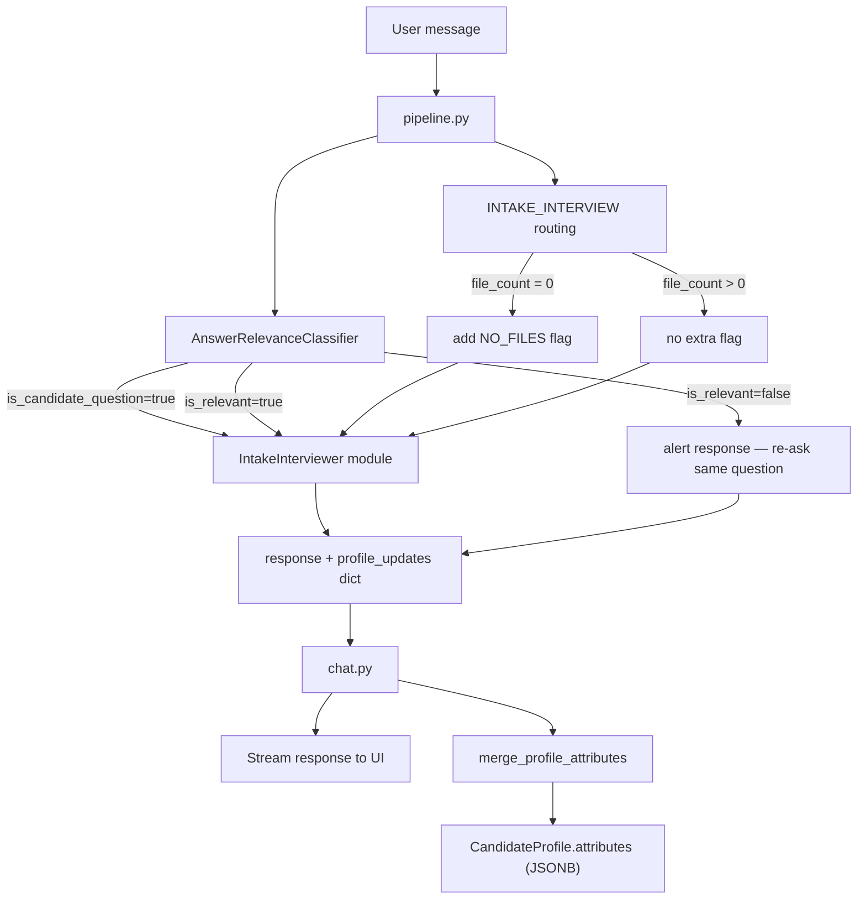

# Intake Interview Q&A Feature

## How it fits in

The interview starts on the very first message — no document upload required. The pipeline always routes to `INTAKE_INTERVIEW` (the old `INTAKE_DOCS` gate is removed). When `file_count == 0`, a `NO_FILES` secondary flag is set and the interviewer appends a single-line nudge to each response: *"Uploading your resume or transcripts will let me give you much more tailored guidance."* When files are present, the nudge is omitted.

## Data flow

## Question bank (drives the interview)

The interviewer cycles through these areas, skipping any already captured in `attributes`:

- Walk me through your career path.
- Why did you choose your undergrad degree?
- Why did you move between roles?
- What do you actually want after the program?
- Why now?
- Why not stay in your current path?
- What's the strongest evidence for your goals?
- What is weak or missing in your profile?

## Files to change

### 1. New: `[backend/app/dspy/answer_relevance_classifier.py](backend/app/dspy/answer_relevance_classifier.py)`

Runs before the interviewer on every user message (when intent is `INTAKE_INTERVIEW`).

- `AnswerRelevanceSignature` — inputs: `last_question_asked` (the most recent assistant question), `user_message`; outputs:
  - `classification`: one of `relevant | irrelevant | candidate_question`
  - `reasoning`: short explanation (used for logging/tracing only)
- `OpenAIAnswerRelevanceClassifier(dspy.Module)` — wraps `dspy.Predict(AnswerRelevanceSignature)`
- `MockAnswerRelevanceClassifier(dspy.Module)` — deterministic heuristic: detects a `candidate_question` if the message ends with `?`; marks `irrelevant` if the message is very short (< 8 words) and contains none of the topic keywords; otherwise `relevant`

**Behaviour by classification result:**

- `relevant` — proceed normally to `IntakeInterviewer`, save profile updates
- `candidate_question` — pass to `IntakeInterviewer` with a flag so the LLM answers the candidate's question first, then re-asks the original question (no profile update saved for this turn)
- `irrelevant` — skip `IntakeInterviewer`; return a fixed alert re-asking the original question, e.g. *"That doesn't seem to address the question. [original question]"*; no profile update saved

### 2. New: `[backend/app/dspy/intake_interviewer.py](backend/app/dspy/intake_interviewer.py)`

- `OpenAIIntakeInterviewSignature` — inputs: `candidate_name`, `current_profile_json`, `conversation_history`, `user_message`, `has_files`, `answer_classification` (`relevant | candidate_question`); outputs: `response` (acknowledgement + next question, or answer to candidate's question + re-ask) and `profile_updates_json`. The system prompt instructs the LLM to ask one question at a time, skip already-covered areas, and append the no-files nudge when `has_files = false`.
- `OpenAIIntakeInterviewer(dspy.Module)` — wraps `dspy.Predict(OpenAIIntakeInterviewSignature)`
- `MockIntakeInterviewer(dspy.Module)` — deterministic: picks the next unanswered question from the bank by checking which attribute keys are absent in `current_profile_json`; when `answer_classification = candidate_question`, prepends a generic answer placeholder and re-asks; appends the nudge when `has_files=False`; does simple keyword extraction for `profile_updates_json`

### 2. `[backend/app/schemas/intent_routing.py](backend/app/schemas/intent_routing.py)`

- Add `INTAKE_INTERVIEW = "intake_interview"` to `PrimaryIntent`
- Add `NO_FILES = "no_files"` to `SecondaryFlag`

### 3. `[backend/app/dspy/pipeline.py](backend/app/dspy/pipeline.py)`

- Change `generate_assistant_response` return type: `str` → `tuple[str, dict]`
- Routing update: always set `primary_intent = PrimaryIntent.INTAKE_INTERVIEW`; add `SecondaryFlag.NO_FILES` when `file_count == 0` (replaces the old `INTAKE_DOCS` / `INTAKE_GOALS` branching)
- For non-off-topic, non-disallowed messages:
  1. Run `AnswerRelevanceClassifier` — extract `last_question_asked` from the most recent assistant message in `recent_messages`
  2. If `irrelevant` → short-circuit: return the alert string + empty profile_updates dict
  3. If `relevant` or `candidate_question` → call `IntakeInterviewer` passing `answer_classification`
- Parse `profile_updates_json` from module output; return empty dict when classification was `candidate_question` (no answer to extract)
- `last_question_asked` defaults to `""` on the very first turn (no prior assistant message), in which case classification is skipped and the interviewer runs directly

### 4. `[backend/app/repositories/candidate_repo.py](backend/app/repositories/candidate_repo.py)`

- Add `merge_profile_attributes(candidate_id, updates: dict)` — loads or creates the profile, deep-merges `updates` into `profile.attributes`, flushes. This avoids overwriting existing keys.

### 5. `[backend/app/api/routes/chat.py](backend/app/api/routes/chat.py)`

- Both call sites of `generate_assistant_response` unpack `(full_text, profile_updates)`
- In `stream_assistant_response`, after the generator finishes streaming and commits the assistant message, call `candidate_repo.merge_profile_attributes(candidate_id, profile_updates)` and commit
- Import and instantiate `CandidateRepository` in the route
- The `create_thread` greeting path ignores the profile_updates dict (it will be empty at the start)

## Profile attributes shape

Keys written to `CandidateProfile.attributes`:

- `career_path`, `undergrad_degree`, `role_transitions`
- `post_mba_goals`, `motivation_timing`, `why_not_current_path`
- `evidence_for_goals`, `identified_weaknesses`

