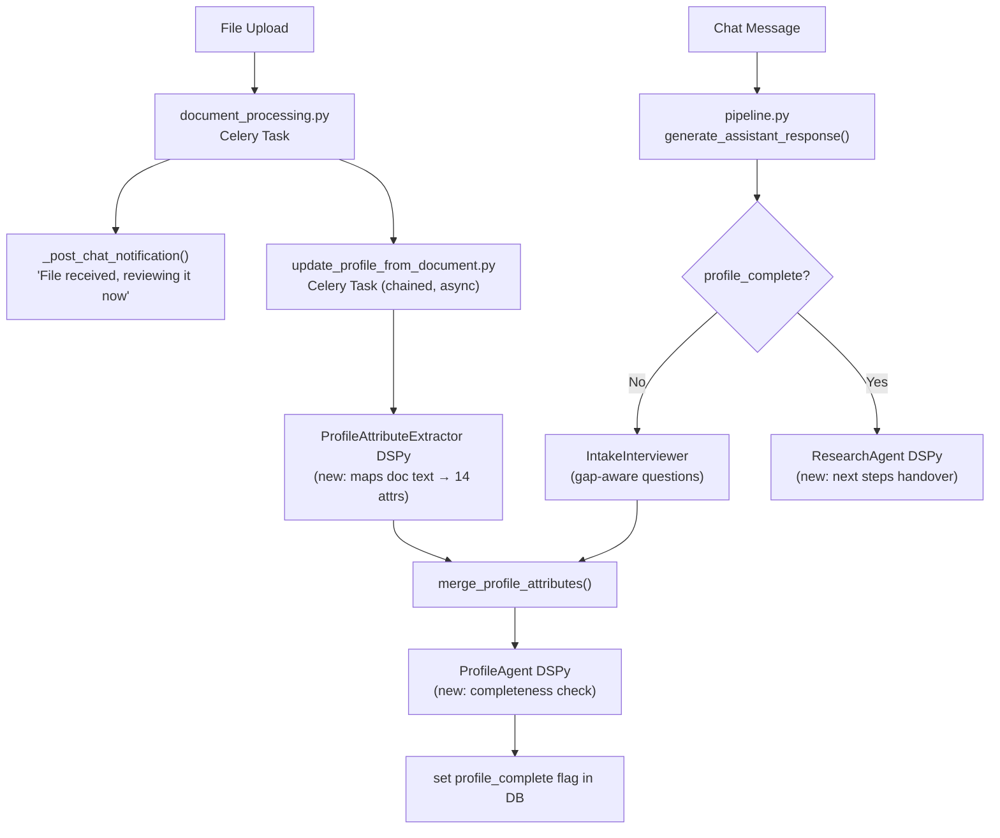

# Profile Agent & Research Handoff Plan

## Architecture Overview




## 1. Profile Attribute Schema

The 14 attribute keys (matching the example file):

- **Candidate-input** (9): `core_identity`, `domain_base`, `core_strengths`, `differentiation_layer`, `intellectual_working_style`, `motivation`, `core_tension`, `transferable_assets`, `risks`
- **Synthesized by Profile Agent** (5): `strategy`, `narrative_direction`, `key_positioning`, `emphasis_areas`, `downplay_areas`

The key names and their descriptions (what good content looks like) are defined once as a constant `PROFILE_ATTRIBUTE_SCHEMA: dict[str, str]` in `intake_interviewer.py` and imported wherever needed. No hardcoded questions — the schema is passed to the LLM which decides what to ask.

## 2. DB Model Change — `profile_complete` flag

Add to `CandidateProfile` in `[candidate.py](backend/app/db/models/candidate.py)`:

```python
profile_complete: Mapped[bool] = mapped_column(Boolean, nullable=False, default=False, insert_default=False)
```

Add a repo method `set_profile_complete(candidate_id, complete: bool)` to `[candidate_repo.py](backend/app/repositories/candidate_repo.py)`.

> Migration will be auto-generated with Alembic after confirmation.

## 3. New DSPy module — `profile_attribute_extractor.py`

`ProfileAttributeExtractorSignature` inputs: `document_text`, `current_profile_json`, `document_type`.
Output: `attribute_updates_json` — a JSON object with any of the 14 keys found in the document.

Used in the new `update_profile_from_document` Celery task (see §8), not inline in `document_processing.py`. Calls `merge_profile_attributes()` with the result.

## 4. New DSPy module — `profile_agent.py`

`ProfileCompletenessSignature` inputs: `profile_attributes_json`, `attribute_schema_description`.
Outputs: `is_complete` (bool), `gaps_json` (list of missing/thin attribute names).

- Called after every profile attribute update (both from document processing and from chat interview answers).
- Updates the `profile_complete` DB flag.
- Mock version: checks that all 9 candidate-input attributes are non-empty.

## 5. New DSPy module — `research_agent.py`

`ResearchAgentSignature` inputs: `candidate_name`, `profile_attributes_json`.
Output: `response` — a handover message that:

1. Congratulates the candidate on completing the intake.
2. Summarises what the research agent will now do (school research, fit analysis, etc.).
3. Lists concrete next steps.

## 6. Update `intake_interviewer.py`

- Remove `INTERVIEW_QUESTIONS` entirely.
- Add `PROFILE_ATTRIBUTE_SCHEMA: dict[str, str]` — a mapping of attribute key → description of what good content looks like (e.g. `"motivation": "The candidate's core reason for pursuing the degree, beyond career progression"`). This is the shared schema used by all modules.
- `OpenAIIntakeInterviewSignature` gets two new inputs:
  - `attribute_schema_json`: the full schema serialised as JSON so the LLM knows what each attribute means.
  - `profile_gaps_json`: list of attribute keys still missing or thin, provided by the Profile Agent.
- The system prompt instructs the LLM to **generate a natural, contextually relevant question** that would best fill the highest-priority gap — it must not follow a script and should feel like a real conversation, referencing what the candidate has already said.
- Output fields remain `response` + `profile_updates_json`.
- `MockIntakeInterviewer` iterates over `profile_gaps_json` and asks a generic "tell me more about X" question for the first gap, so tests remain deterministic without hardcoded strings.
- When `profile_complete=True`, the interviewer is not called (pipeline routes to ResearchAgent instead).

## 7. Update `pipeline.py`

In `generate_assistant_response()`:

- Accept `profile_complete: bool` as a new parameter (sourced from `candidate_profile["profile_complete"]`).
- When `profile_complete=True`: call `ResearchAgent` and return its response.
- When `profile_complete=False`: existing intake interview flow, plus after getting `profile_updates`, call Profile Agent and update the flag.

The call site is `[chat.py](backend/app/api/routes/chat.py)` — pass `profile_complete` from the loaded `CandidateProfile`.

## 8. Document processing — async profile update

The two tasks are **chained** so the notification fires immediately, and profile enrichment runs after:

```
process_uploaded_document  (existing task)
  → step 6: persist extracted text + file status = READY
  → step 7: _post_chat_notification()  "File received, reviewing it now"
  → step 8: chain( update_profile_from_document.delay(file_id) )   ← NEW, fires async
```

**New Celery task `update_profile_from_document`** in a new file `backend/app/workers/tasks/profile_update.py`:

1. Load `UploadedFile` (reads `extra["extracted_text"]` saved by the parent task).
2. Load current `CandidateProfile.attributes`.
3. Run `ProfileAttributeExtractor` → `merge_profile_attributes()`.
4. Run `ProfileAgent` → `set_profile_complete()`.
5. If profile just became complete, post a second chat message: "Your profile is complete — the research agent will now take over."

This keeps `document_processing.py` unchanged except for appending `.delay()` at the end, and avoids any latency added to the user-facing notification.

## Files Changed Summary

- `backend/app/db/models/candidate.py` — add `profile_complete` field
- `backend/app/repositories/candidate_repo.py` — add `set_profile_complete()`, update `merge_profile_attributes()` to trigger profile agent
- `backend/app/dspy/intake_interviewer.py` — remove hardcoded questions, add `PROFILE_ATTRIBUTE_SCHEMA`, update signature for dynamic question generation
- `backend/app/dspy/profile_attribute_extractor.py` — **new**
- `backend/app/dspy/profile_agent.py` — **new**
- `backend/app/dspy/research_agent.py` — **new**
- `backend/app/dspy/pipeline.py` — route based on `profile_complete`, call profile agent
- `backend/app/workers/tasks/document_processing.py` — chain `update_profile_from_document` at the end
- `backend/app/workers/tasks/profile_update.py` — **new** async Celery task for attribute extraction + profile agent
- `backend/app/api/routes/chat.py` — pass `profile_complete` to pipeline

