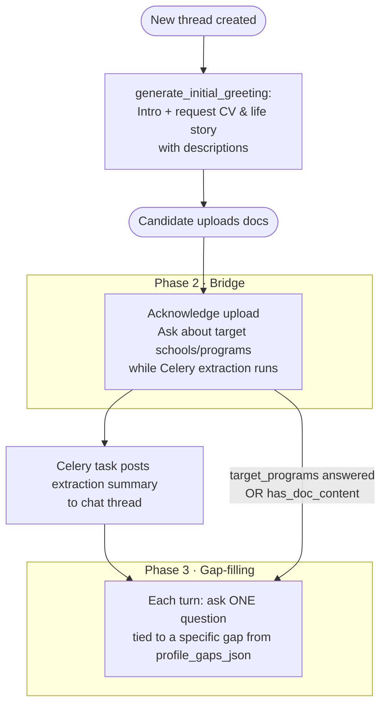

# Profile Manager Conversation Flow

## Current State

The intake interviewer immediately starts asking gap questions. There is no intro, no structured document request, no transitional phase while documents are being extracted, and no constraint that questions must relate to a specific gap.

## New 3-Phase Flow




### Phase detection (computed each turn in `generate_assistant_response`)

- `has_doc_content` = any of `domain_base`, `core_identity`, `core_strengths`, `transferable_assets` is filled
- `target_programs_filled` = `attributes.get("target_programs")` is non-empty

```
intake_phase:
  "intro"        → file_count == 0
  "bridge"       → file_count > 0 AND NOT has_doc_content AND NOT target_programs_filled
  "gap_filling"  → file_count > 0 AND (has_doc_content OR target_programs_filled)
```

---

## Changes by File

### 1. `[backend/app/dspy/profile_agent.py](backend/app/dspy/profile_agent.py)`

- Add `target_programs` to `PROFILE_ATTRIBUTE_SCHEMA` (description: "Specific MBA programs and schools the candidate is targeting or considering, including reasoning.")
- Do **not** add it to `CANDIDATE_INPUT_ATTRIBUTES` — it is supplementary data captured during the bridge phase, not a core completeness requirement.

### 2. `[backend/app/dspy/intake_interviewer.py](backend/app/dspy/intake_interviewer.py)`

Add `intake_phase` input field to `OpenAIIntakeInterviewSignature` and rewrite the system prompt to describe all 3 phases:

- **intro**: No docs yet. Encourage the candidate to share context verbally if they like, but make clear the first concrete action is uploading their CV and life story.
- **bridge**: Docs received and being processed. Warmly acknowledge the upload. Ask about target programs/schools as the single bridge question (stored as `target_programs`). Do not ask gap questions yet.
- **gap_filling**: Docs extracted. Ask exactly one question per turn targeting the highest-priority gap from `profile_gaps_json`. Frame each question around that specific gap (use the gap key as context, do not ask generic questions).

Update `MockIntakeInterviewer` with the same 3-phase logic (deterministic, no LLM).

Add `target_programs` hint to `_MOCK_QUESTION_HINTS`.

Remove the `_NO_FILES_NUDGE` append in Phase 2/3 (the phase itself handles the doc request; nudge is only relevant in intro phase).

### 3. `[backend/app/dspy/pipeline.py](backend/app/dspy/pipeline.py)`

`**generate_assistant_response`**: compute `intake_phase` and pass it to the interviewer.

`**generate_initial_greeting`**: replace the current preamble with a proper introduction that explains the 3-step process and explicitly requests CV + life story with descriptions:

- CV: "I'm looking for your career trajectory, the types of roles you've held, scope of responsibilities, and patterns that reveal your professional identity."
- Life story: "This can be a personal statement draft, narrative bio, or a few paragraphs about what shaped you — values, turning points, why an MBA now."

### 4. `[backend/app/workers/tasks/profile_update.py](backend/app/workers/tasks/profile_update.py)`

After a successful doc extraction (`attribute_updates` is non-empty), post an **interim chat message** to the active thread summarising what was reviewed — e.g.:

> "I've finished reviewing your CV. I can see you have a background in [domain] with roles like [core_identity snippet]. I've captured your career trajectory and key strengths into your profile. Let me now ask you a few targeted questions to fill in the remaining gaps."

This replaces the silent async extraction with explicit candidate feedback. (The existing completion notification for `is_complete` is kept as-is.)