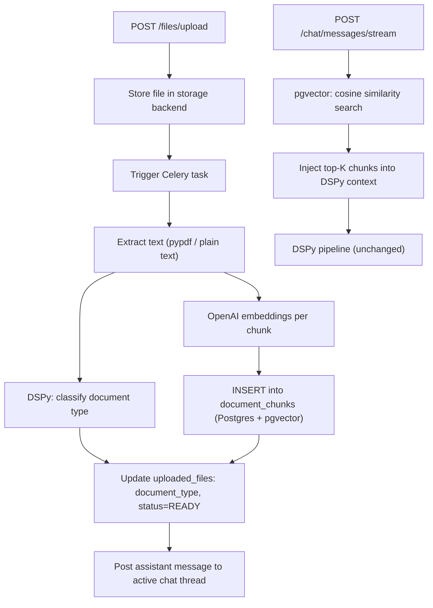

# RAG Document Processing Plan

## Architecture




## Changes by File

### 1. `docker-compose.yml` + `docker-entrypoint.sh`

Switch the Postgres image to one with pgvector pre-installed:

```yaml
postgres:
  image: pgvector/pgvector:pg16
```

Add `CREATE EXTENSION IF NOT EXISTS vector;` to the startup sequence in `docker-entrypoint.sh` (before `alembic upgrade head`), or handle it via Alembic migration.

No new Docker service required — pgvector runs inside the existing Postgres container.

### 2. `backend/app/db/models/files.py`

Add a new `document_type` enum and column:

```python
class DocumentType(str, enum.Enum):
    cv = "cv"
    life_story = "life_story"
    recommendation_letter = "recommendation_letter"
    grade_sheet = "grade_sheet"
    irrelevant = "irrelevant"
    unclassified = "unclassified"
```

Add `document_type: Mapped[DocumentType | None]` to `UploadedFile`.

### 3. `backend/app/db/models/document_chunk.py` *(new file)*

New `DocumentChunk` SQLAlchemy model:

```python
from pgvector.sqlalchemy import Vector

class DocumentChunk(Base, UUIDPrimaryKeyMixin, TimestampMixin):
    __tablename__ = "document_chunks"
    file_id: Mapped[uuid.UUID]          # FK → uploaded_files.id
    candidate_id: Mapped[uuid.UUID]     # FK → candidates.id (for fast filtering)
    chunk_index: Mapped[int]
    text: Mapped[str]
    embedding: Mapped[list] = mapped_column(Vector(1536))  # text-embedding-3-small
```

With an HNSW index on `embedding` for fast ANN search.

### 4. `backend/app/core/vector_store.py` *(new file)*

- `upsert_chunks(session, file_id, candidate_id, chunks, embeddings)` — bulk insert `DocumentChunk` rows, deleting any previous chunks for that `file_id` first
- `search(session, candidate_id, query_embedding, top_k=6)` → list of text strings, filtered by `candidate_id`, ordered by cosine distance (`<=>` operator)

### 5. `backend/app/dspy/document_classifier.py` *(new file)*

Mirrors the existing `openai_intent_classifier.py` pattern:

- `DocumentClassificationSignature`: input `document_text` → output `document_type` (cv / life_story / recommendation_letter / grade_sheet / irrelevant), `reasoning`
- `DocumentClassifier` wraps `dspy.Predict(DocumentClassificationSignature)` in `run_dspy_module()`
- `StaticDocumentClassifier` — keyword heuristics fallback for `DSPY_MODE=mock`

### 6. `backend/app/workers/document_processing.py` *(new file)*

New Celery task `process_uploaded_document(file_id)`:

1. Load `UploadedFile` from DB (sync SQLAlchemy session)
2. Fetch bytes from storage backend
3. Extract text — move `_extract_text_from_bytes` here (unchanged logic)
4. Classify with `DocumentClassifier`
5. Embed each chunk with `openai.embeddings.create(model="text-embedding-3-small")`
6. Upsert via `vector_store.upsert_chunks()`
7. Update `uploaded_files`: `document_type`, `status=READY`, keep `extra.extracted_text` for fallback
8. Find candidate's most-recent non-archived `chat_thread`, insert an assistant `ChatMessage`:
  > "I've received your document **{filename}**. It looks like a {document_type_label} — I'm reviewing it now and will use it to help guide your application."

### 7. `backend/app/api/routes/files.py`

- Remove `_extract_text_from_bytes` and all inline extraction logic
- After file bytes are stored, set `status=UPLOADING` (no text in `extra` yet) and commit
- Call `process_uploaded_document.delay(str(file.id))` to enqueue the Celery task
- File is returned immediately to the client

### 8. `backend/app/api/routes/chat.py`

Replace the current naive doc-text injection with pgvector semantic search:

- Embed `user_message` with `openai.embeddings.create(model="text-embedding-3-small")`
- Call `vector_store.search(session, candidate_id, query_embedding, top_k=6)`
- Assemble `docs_snippets` from the returned chunks (same interface as before — DSPy pipeline unchanged)

### 9. `backend/requirements.txt`

Add:

- `pgvector` (Python client with SQLAlchemy integration)

## What Becomes Redundant

- `_extract_text_from_bytes` in `files.py` — moved to the worker task and deleted from the route
- The naive "load up to 3 files' `extracted_text`" block in `chat.py` — replaced by vector search
- `extracted_chunks` in `extra` JSONB — still stored as fallback but no longer the primary retrieval path

