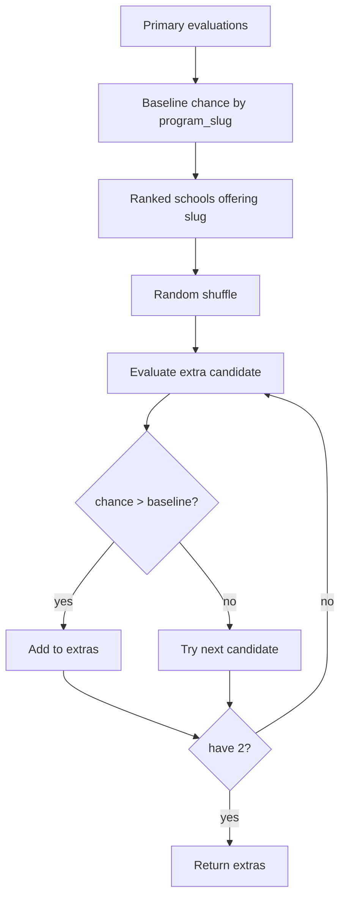

## Context (current behavior)
- Extra recommendations are generated in `pick_similar_programs()` in [`backend/app/dspy/admission_evaluation.py`](backend/app/dspy/admission_evaluation.py). It deterministically walks `ORDERED_SCHOOL_NAMES` and suggests the same `program_slug` at other schools when a primary chance is <85.

```291:328:/Users/shronme/development/mba_admission/backend/app/dspy/admission_evaluation.py
def pick_similar_programs(
    *,
    primary_evaluations: list[dict[str, Any]],
    selected_keys: set[tuple[str, str]],
    max_programs: int = 3,
) -> list[dict[str, str]]:
    """
    Deterministic fallback: for any primary program with chance < 85, suggest same program_slug
    at other schools from catalog until max_programs.
    """
    # ...
    for school in ORDERED_SCHOOL_NAMES:
        for slug in weak_slugs:
            # ...
            out.append({"school": school, "program_slug": slug, "program_display_name": label})
            if len(out) >= max_programs:
                return out
    return out
```

- `ORDERED_SCHOOL_NAMES` is currently **alphabetical**, not ranked, in [`backend/app/constants/graduate_programs_catalog.py`](backend/app/constants/graduate_programs_catalog.py):

```32:34:/Users/shronme/development/mba_admission/backend/app/constants/graduate_programs_catalog.py
PROGRAMS_BY_SCHOOL: dict[str, list[dict[str, Any]]] = _load_schools_map()
ORDERED_SCHOOL_NAMES: list[str] = sorted(PROGRAMS_BY_SCHOOL.keys())
ALLOWED_INTAKE_SCHOOL_NAMES: frozenset[str] = frozenset(PROGRAMS_BY_SCHOOL.keys())
```

- Extra rows are evaluated via `evaluate_extra_program_json()` and currently do **not** include `admission_chance_1_100`, so there’s no way to enforce the “chance higher than chosen program” requirement without changing that evaluation shape.

## Proposed change
### 1) Add ranked-school ordering derived from `graduate_programs_by_school.json`
- Update [`backend/app/constants/graduate_programs_catalog.py`](backend/app/constants/graduate_programs_catalog.py) to also load `school_rankings.entries` and expose:
  - `RANKED_SCHOOL_NAMES`: schools present in rankings, sorted by rank ascending (ties stable/alphabetical), filtered to those also present in `PROGRAMS_BY_SCHOOL`.
  - Helper `ranked_schools_offering_program(program_slug: str) -> list[str]` that returns `RANKED_SCHOOL_NAMES` filtered to schools that contain that `program_slug`.
- Because you chose **rank_only**, we will only sample from ranked schools (no fallback to unranked).

### 2) Generate candidate pools randomly from ranked schools that offer the desired program
- Replace/augment `pick_similar_programs()` in [`backend/app/dspy/admission_evaluation.py`](backend/app/dspy/admission_evaluation.py) with a new helper that:
  - Determines “desired programs” as the set of `program_slug`s for which the candidate’s primary evaluation is weak (<85) (keeping the existing trigger), or optionally always uses all selected slugs if you want extras even when all primaries are strong.
  - For each desired `program_slug`, builds a pool of ranked schools offering it, excluding `selected_keys`.
  - Randomly shuffles within that pool (using `random.Random(seed)` where seed can be derived from `candidate_id` or `ai_run_id` for reproducibility).
  - Returns an ordered list of (school, slug, label) candidates to try.

### 3) “Check chances until you have 2 better” (chance gate)
- Update the extra-evaluation loop in [`backend/app/workers/tasks/admission_evaluation_task.py`](backend/app/workers/tasks/admission_evaluation_task.py) so it **keeps trying candidates** from the randomized pool until:
  - It has accepted 2 extras total, and
  - Each accepted extra has `admission_chance_1_100` **greater than** the baseline chance for the candidate’s chosen program(s) with the same `program_slug`.
- Baseline definition (your choice): **use the max primary `admission_chance_1_100` among selected programs with that same `program_slug`**.
- Candidates that fail the chance gate are skipped (still counted as attempted so we avoid infinite loops).

### 4) Extend `evaluate_extra_program_json()` to include admission chance
- Update [`backend/app/dspy/admission_evaluation.py`](backend/app/dspy/admission_evaluation.py) `ExtraSig` to output JSON containing existing keys used by the UI plus a new key:
  - `admission_chance_1_100: int` (and optionally `admission_band` if useful).
- The frontend (`apps/web/src/components/AdmissionEvaluationPanel.tsx`) will continue to work unchanged because it only reads `match_strength_1_100`, `key_match`, `action_item`, and `meta`.

### 5) Guardrails
- Add a hard cap on attempts (e.g., try up to N=25 candidate evaluations across all slugs) to avoid long-running jobs when few “better than baseline” options exist.
- If we can’t find 2 qualifying extras within the cap, we return however many we found (0–1–2).

## Data flow (after change)

