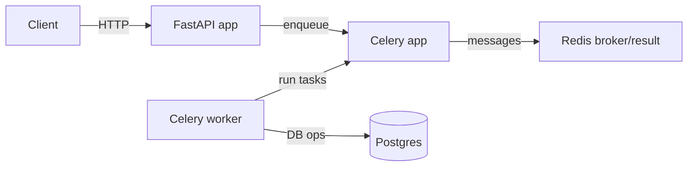

## Scope

Implement `TASK 001` per your backlog: FastAPI skeleton, `/health`, config management, Celery app wiring, Redis config, Postgres connection setup, basic logging, and local dev `docker-compose` for Postgres + Redis.

This repo currently lacks the `backend/` directory entirely, but CI expects it (see `[.github/workflows/ci.yml](backend/.github/workflows/ci.yml)` which runs `pip install -r requirements.txt` and `pytest` inside `backend/`).

## Target architecture (wiring)

## Implementation plan

1. Create backend package structure under `backend/` matching the backlog’s suggested layout.
  - Add `backend/app/main.py`, `backend/app/core/config.py`, `backend/app/core/db.py`, `backend/app/core/celery_app.py`.
  - Add `backend/app/api/routes/health.py` and `backend/app/api/routes/__init__.py`.
  - Add `backend/app/services/` and `backend/app/dspy_modules/` as empty packages (placeholders for later tasks).
  - Add `backend/app/workers/tasks/` with at least one minimal Celery task (e.g., `ping_redis`) so the worker can demonstrate connectivity.
2. Add config management with `pydantic-settings`.
  - `backend/app/core/config.py` defines settings for:
    - `ENV`, `LOG_LEVEL`
    - `DATABASE_URL`
    - `REDIS_URL` (and Celery `broker_url`/`result_backend` derived from it)
    - `CELERY_TASK_DEFAULT_QUEUE` (optional)
    - `HEALTHCHECK_DB` (default false to keep CI lightweight)
  - Ensure settings are friendly for Railway env vars.
3. Implement async Postgres wiring (since you selected async SQLAlchemy).
  - `backend/app/core/db.py` uses `sqlalchemy.ext.asyncio.create_async_engine` and an `async_sessionmaker`.
  - Provide a FastAPI dependency `get_db_session()` that yields an `AsyncSession`.
  - Provide a non-invasive `async def test_db_connection()` utility for manual verification (avoid running it automatically in CI).
4. Implement Celery + Redis wiring.
  - `backend/app/core/celery_app.py` creates and configures the Celery instance from settings.
  - Configure JSON serialization, broker/result backend = Redis.
  - Provide a tiny example task in `backend/app/workers/tasks/ping_redis.py` that pings Redis.
  - Ensure the Celery app can import cleanly without requiring Postgres/Redis to be up at import time.
5. Add FastAPI skeleton and health endpoint.
  - `backend/app/main.py` creates the FastAPI app, installs basic logging, includes health router.
  - `/health` endpoint returns `{"status":"ok"}`.
  - Optionally, if `HEALTHCHECK_DB=true`, include `db_connected` and `redis_connected` fields (but keep default off).
6. Add basic structured logging.
  - `backend/app/core/logging.py` provides a `configure_logging()` using stdlib logging (optionally JSON formatting if desired).
  - Ensure logs include `logger name`, `level`, and message; keep it simple for Railway.
7. Add dependencies and tests so CI passes.
  - Create `backend/requirements.txt` including runtime deps + test deps required by CI.
  - Create `backend/tests/test_health.py` that boots the FastAPI app and validates `/health` returns OK.
8. Add local dev docker-compose.
  - Create root `docker-compose.yml` with:
    - `redis` service (with exposed port 6379 for local development)
    - `postgres` service (with exposed port 5432)
  - Add root `.env.example` (or `backend/.env.example`) with local values for `DATABASE_URL` and `REDIS_URL` that match service hostnames (`postgres`, `redis`).
9. Railway-friendly Dockerization (since you selected Docker).
  - Create `backend/Dockerfile` that:
    - installs `requirements.txt`
    - sets `WORKDIR` to `backend/`
    - runs from module `app.*` correctly
  - Document Railway process split:
    - Web service command: `uvicorn app.main:app --host 0.0.0.0 --port ${PORT:-8000}`
    - Worker service command: `celery -A app.core.celery_app worker -l info`
  - Document required env vars on Railway: `DATABASE_URL`, `REDIS_URL` (and optionally `LOG_LEVEL`, `ENV`).

## Deliverables checklist vs acceptance criteria

- FastAPI boots locally: `uvicorn` command documented
- `/health` returns OK: endpoint + test
- Celery worker starts successfully: documented `celery worker` command
- Redis broker is connected: run `ping_redis` task to verify
- DB session can initialize: manual `test_db_connection()` utility
- docker-compose can start local dependencies: `docker compose up -d redis postgres`
- Railway deployability: step-by-step Railway runbook (Docker-based) provided at the end of implementation (documented in-repo)
- Cross-component wiring check: runnable “wiring smoke test” that validates FastAPI + Celery enqueue + Celery worker + Redis broker + Postgres connectivity (FE stand-in via `curl`), before frontend work

